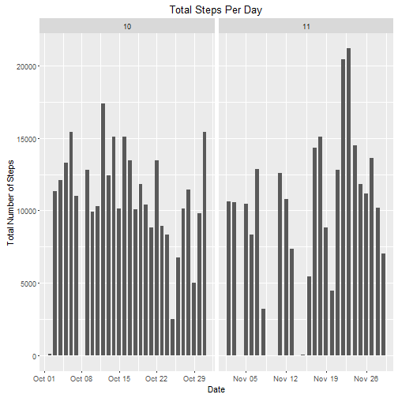
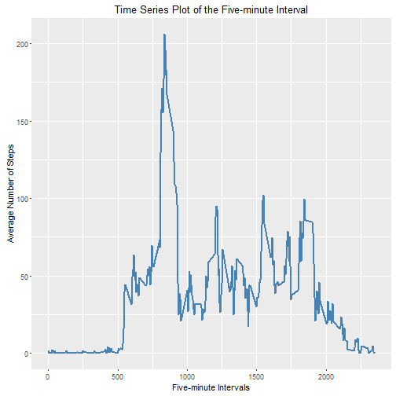
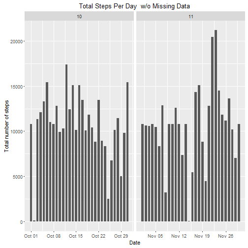

Reproducible Research: Assignment: Course Project 1

Created by Michael on Jan 10, 2016


```r
echo = TRUE  
```

### Loading and processing the data

```r
data <- read.csv("activity.csv", colClasses = c("integer", "Date", "factor"))
data$month <- as.numeric(format(data$date, "%m"))
noNA <- na.omit(data)
rownames(noNA) <- 1:nrow(noNA)
```

### Make a histogram of the total number of steps taken each day, ignore the missing values in the dataset.


```r
library(ggplot2)
```

```
## Warning: package 'ggplot2' was built under R version 3.2.3
```

```r
ggplot(noNA, aes(date, steps)) + geom_bar(stat = "identity", width = 0.7) + facet_grid(. ~ month, scales = "free") + labs(title = "Total Steps Per Day", x = "Date", y = "Total Number of Steps")
```



### Mean total number of steps taken per day


```r
totalSteps <- aggregate(noNA$steps, list(Date = noNA$date), FUN = "sum")$x
print(paste("The mean steps per day is: ", mean(totalSteps)))
```

```
## [1] "The mean steps per day is:  10766.1886792453"
```

### Median total number of steps taken per day


```r
print(paste("The median steps per day is: ", median(totalSteps)))
```

```
## [1] "The median steps per day is:  10765"
```

### Make a time series plot (i.e. type = "l") of the five-minute interval (x-axis) and the average number of steps taken, averaged across all days (y-axis)


```r
avgSteps <- aggregate(noNA$steps, list(interval = as.numeric(as.character(noNA$interval))), FUN = "mean")
names(avgSteps)[2] <- "meanOfSteps"
ggplot(avgSteps, aes(interval, meanOfSteps)) + geom_line(color = "steelblue", size = 0.8) + labs(title = "Time Series Plot of the Five-minute Interval", x = "Five-minute Intervals", 
y = "Average Number of Steps")
```



```r
avgSteps[avgSteps$meanOfSteps == max(avgSteps$meanOfSteps), ]
```

```
##     interval meanOfSteps
## 104      835    206.1698
```

### Including missing values

* Use the mean for that five-minute interval to fill each NA value. Create a new dataset.


```r
newData <- data 
for (i in 1:nrow(newData)) {
    if (is.na(newData$steps[i])) {
        newData$steps[i] <- avgSteps[which(newData$interval[i] == avgSteps$interval), ]$meanOfSteps
    }
}
```

* Make a histogram of the total number of steps taken each day. 


```r
ggplot(newData, aes(date, steps)) + geom_bar(stat = "identity",
                                             width = 0.7) + facet_grid(. ~ month, scales = "free") + labs(title = "Total Steps Per Day  w/o Missing Data", x = "Date", y = "Total number of steps")
```



### Are there differences in activity patterns between weekdays and weekends?


```r
newData$weekdays <- factor(format(newData$date, "%A"))

levels(newData$weekdays) <- list(Weekdays = c("Monday", "Tuesday", "Wednesday", "Thursday", "Friday"), Weekends = c("Saturday", "Sunday"))

avgSteps <- aggregate(newData$steps, 
                      list(interval = as.numeric(as.character(newData$interval)), 
                           weekdays = newData$weekdays),
                      FUN = "mean")
names(avgSteps)[3] <- "meanOfSteps"

library(lattice)

xyplot(avgSteps$meanOfSteps ~ avgSteps$interval | avgSteps$weekdays, 
       layout = c(1, 2), type = "l", 
       xlab = "Interval", ylab = "Number of Steps")
```


